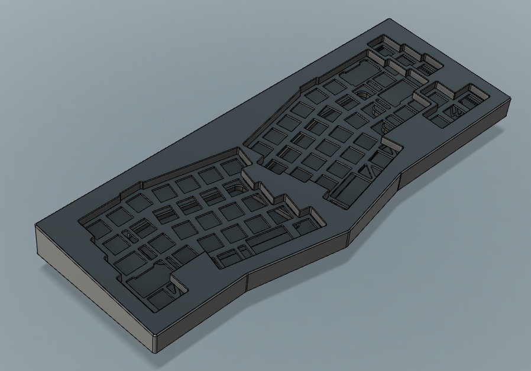
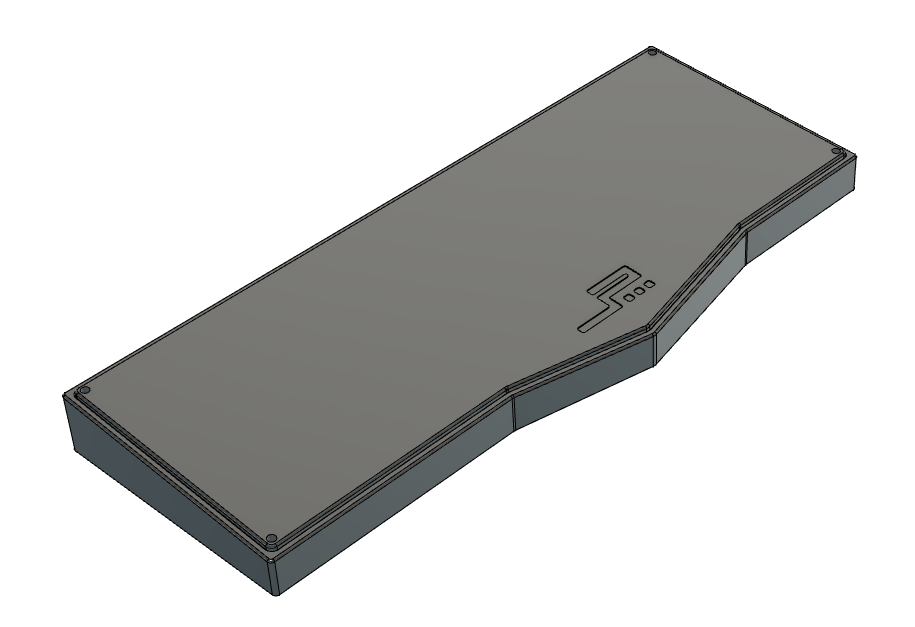

# JP03

 

The goal of this project was to keep the aesthetics of the original JP01 by overset (and by extension, the JP02 run by JLabs) while redoing the internals and fixing the original's issues.

The PCB is a modification of andygunn's mod of FateNozomi's Arisu. I just put two holes so that the plate could work without pushing the two middle-top mounting points up, and reuploaded it in the PCB folder. All credit goes to FateNozomi and andygunn for the design.

### Design

Changes:

1. Added optimized plate 
2. Changed from pseudo-gasket to pure top mount for better acoustics and typing feel
3. Replaced most fillets with chamfers
4. Redid screw holes as to not overlap with fillets (JP02)
5. Changed engraving, added 3 dots and internal ZDC engraving
6. Added bottom acoustic hole instead of large empty space
7. Top port hole changed